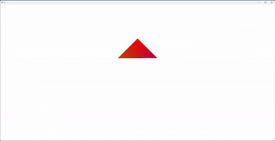
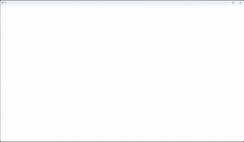
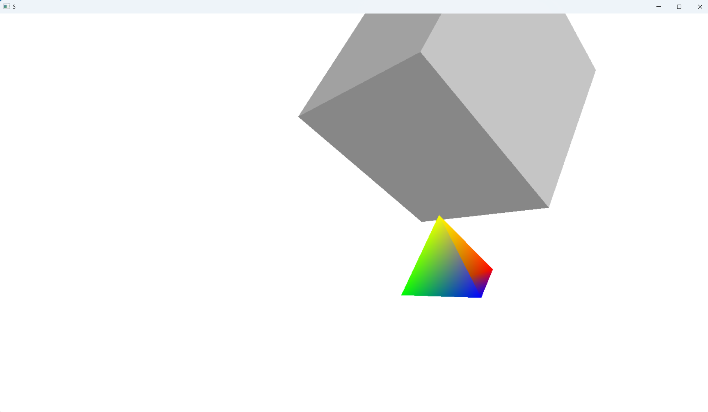

# 软渲染器 Demo


## 📖 项目介绍

这是一个基于 CPU 的软渲染器实现项目，完全从零开始构建完整的图形渲染管线。项目不依赖任何图形 API（如 OpenGL 或 DirectX），通过纯 CPU 计算实现 3D 图形的渲染，是学习计算机图形学原理的绝佳实践项目。

### 🎯 学习目标

通过实现本项目，您将深入理解：

- **渲染管线工作原理**：从顶点处理到片元着色的完整流程
- **3D 图形学数学基础**：向量、矩阵、坐标变换等核心概念
- **软渲染实现原理**：CPU 端的图形渲染技术细节
- **优化技巧**：各种渲染算法的性能优化方法

### 📋 实现顺序建议

1. 数学运算库基础实现
2. Windows API 抽象层封装
3. 渲染核心数据结构设计
4. MVP 矩阵运算（行主序 + 左手坐标系）
5. Sutherland-Hodgman 图元裁剪算法
6. 背面剔除算法优化
7. 透视矫正插值算法
8. 基于重心坐标的光栅化
9. 深度测试与 Z-buffer 实现

### 🎓 前置知识要求

- Windows API 基础使用
- 计算机图形学基本概念
- C++ 编程语言基础
- 线性代数基础

## 🏗️ 项目架构
```bash
Renderer
├── 数学库 (Math)
│   ├── 向量类 (Vector2/3/4)
│   ├── 矩阵类 (Matrix4x4)
│   ├── 几何工具 (几何变换、投影等)
├── 核心部分 (Core)
│    ├── 渲染器 (Renderer)
│    │   ├── 顶点处理 (Vertex Processing)
│    │   ├── 图元装配 (Primitive Assembly)
│    │   ├── 裁切 (Clip)
│    │   ├── 光栅化 (Rasterization)
│    │   ├── 片元处理 (Fragment Processing)
│    ├── 数据结构
│    │   ├── 相机 (Camera)
│    │   ├── 着色器基类 (IShader)
│    │   ├── 网格数据 (Mesh)
│    │   ├── 顶点 (Vertex)
│    │   ├── Transform (Transform)
├── 着色器系统 (Shaders)
│   ├── 默认着色器 (DefaultShader)
└── WindowsAPI抽象层 (Windows)
Tests
├── 数学库测试 (MathTest)
├── 渲染器测试 (RendererTest)
└── WindowsAPi测试 (WindowsTest)
```

## ✨ 功能特性

### 🎮 核心渲染功能
- **基础渲染**：完整的 3D 模型渲染管线
- **深度测试**：基于 Z-buffer 的精确深度管理
- **背面剔除**：法线检测优化渲染性能
- **透视矫正**：准确的顶点属性插值
- **多着色器**：支持多种光照模型

### 📊 技术亮点
- **纯 CPU 实现**：不依赖任何图形 API
- **模块化设计**：各组件解耦，易于扩展
- **完整管线**：实现从顶点到像素的全流程
- **教学友好**：代码注释详尽，适合学习

## 🔗 相关资源

- [图形学基础知识](https://learnopengl.com/) - OpenGL 学习资源
- [Sutherland-Hodgman 算法](https://en.wikipedia.org/wiki/Sutherland%E2%80%93Hodgman_algorithm) - 裁剪算法详解
- [透视矫正插值](https://www.scratchapixel.com/lessons/3d-basic-rendering/rasterization-practical-implementation/perspective-correct-interpolation-vertex-attributes) - 属性插值原理
- [重心坐标系统](https://en.wikipedia.org/wiki/Barycentric_coordinate_system) - 光栅化数学基础

## 🚀 构建与运行

### 环境要求
- **开发环境**：Visual Studio 2019+
- **构建工具**：CMake 3.10+

### 构建步骤

```bash
# 克隆项目
git clone https://github.com/Ker-2311/SoftRenderer-Demo
cd SoftRenderer-Demo

# 创建构建目录
mkdir build
cd build

# 生成解决方案
cmake .. -G "Visual Studio 16 2019"

# 编译项目
cmake --build . --config Release
```

## 🎨 开发进度

### ✅ 已完成功能
- **基础数学库**
  - [x] 向量类 (Vector2/3/4) 实现
  - [x] 矩阵类 (Matrix4x4) 实现
  - [x] 几何变换工具函数
  - [x] 投影矩阵计算

- **Windows抽象层**
  - [x] 窗口创建与管理
  - [x] 消息循环处理
  - [x] 帧缓冲区管理
  - [x] 基本输入处理

- **核心数据结构**
  - [x] 顶点结构 (Vertex) 定义
  - [x] 网格数据 (Mesh) 加载与存储
  - [x] 相机类 (Camera) 实现
  - [x] 变换类 (Transform) 实现

- **渲染管线**
  - [x] MVP矩阵变换系统
  - [x] 顶点处理阶段
  - [x] 图元装配阶段
  - [x] Sutherland-Hodgman裁剪算法
  - [x] 背面剔除算法
  - [x] 透视矫正插值算法
  - [x] 重心坐标光栅化
  - [x] 深度测试 (Z-buffer)
  - [x] 片元处理阶段

- **着色器系统**
  - [x] 着色器基类 (IShader) 接口
  - [x] 默认着色器实现
  - [x] 简单颜色插值着色
  - [x] Phong着色模型
  - [x] Blinn-Phong着色模型

- **测试框架**
  - [x] 数学库单元测试
  - [x] 渲染器功能测试
  - [x] Windows抽象层测试

## ⭐ 项目演示



